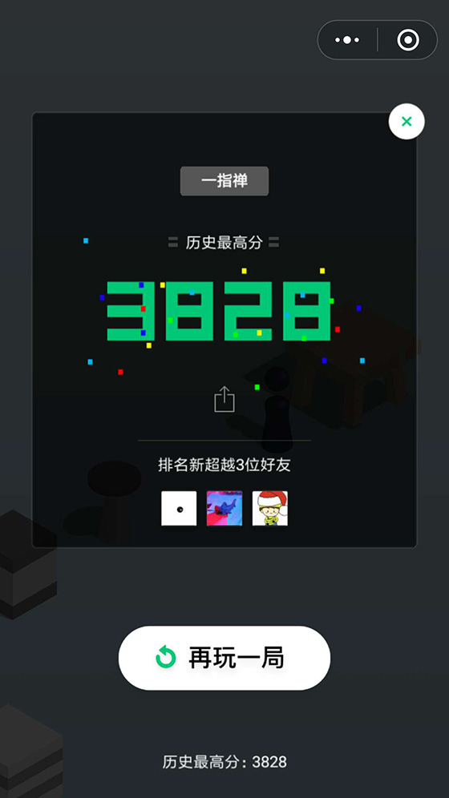
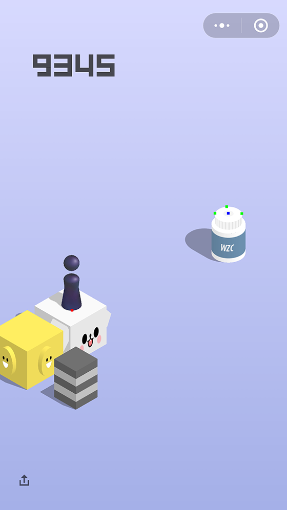
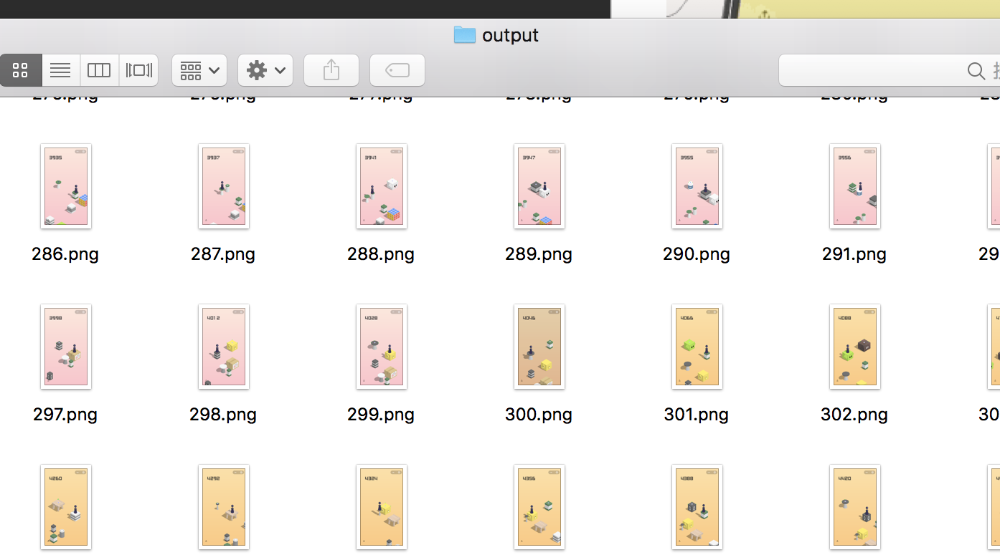
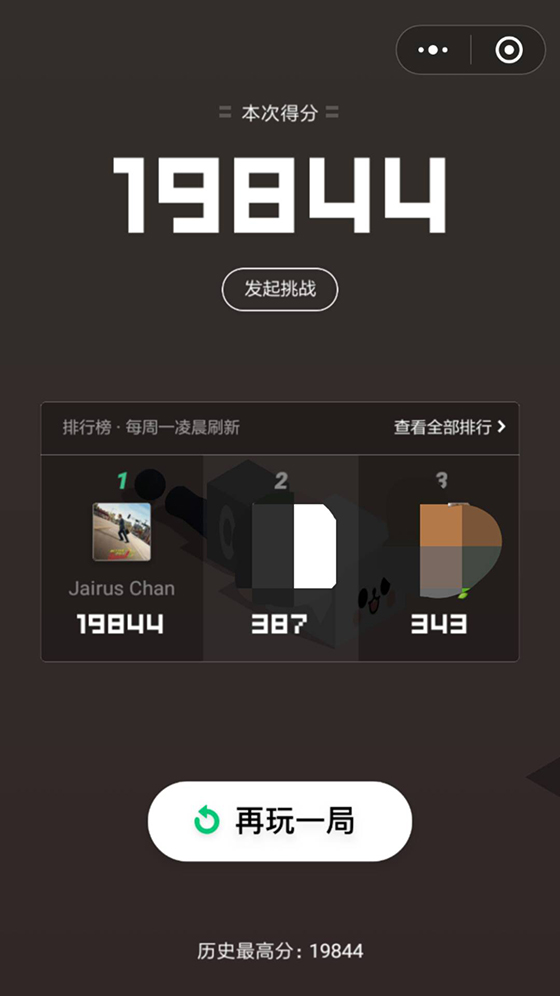
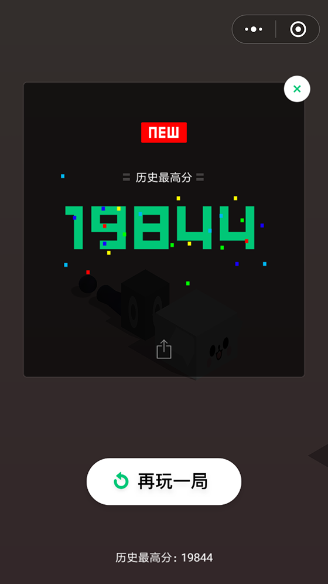
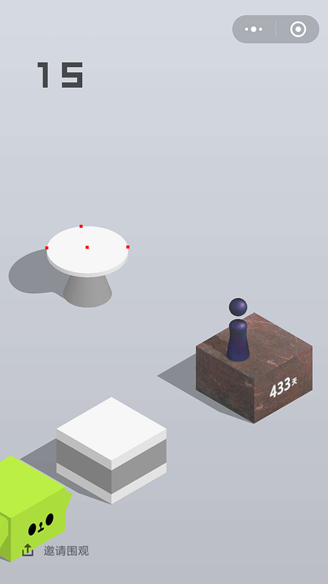

# 腾讯微信跳一跳破解（目前最高19844分）

**我没有想到有那么多同学问我如何导入项目。主要的问题在于：**

* 如何导入项目？
* 为什么不上传wechat\_jump\_hack.iml文件？

[点击此处，查看详细教程](./IMPORT.md)

## 2018/01/05优化

根据同学们的反馈，说分数提交被微信拒绝。于是，稍加优化了一下，搞定。

运行了一小段时间，刷到3800分后，停掉了程序，自己手动跳了几下。顺利提交成绩：




## 2018/01/04优化

根据同学们的反馈，我今天午休时，抽了20分钟，优化了一下算法。
 
1. 提高瓶子的识别率。

	由于瓶子的颜色比较接近，新实现了一种算法用于瓶子的瓶盖的识别。效果如下：
	
	

2. 提高出现特殊盒子时，下步的计算。

	特殊盒子，例如留声机，他的动效时间很长，而且很大，对下一步的识别产生干扰。因此，改进了一下算法，减少干扰的影响。效果如下：
	
	
	
3. 新增加了HackTest.java文件。大家在运行Hack.java后，会在`wechat_jump_hack/out/production/wechat_jump_hack/imgs/input/`目录下存放截图文件。运行Hack.java结束后，再运行HackTest.java，会在`wechat_jump_hack/out/production/wechat_jump_hack/imgs/output/`下生成input目录中的截图的位置标记。

	
	
	* 红点表示玩家位置；
	* 绿点表示下一个盒子的边界点；
	* 蓝点表示下一个盒子的中心点；

	***如果觉得跳得不准的同学，请运行HackTest.java文件，观察标记的位置是否准确。如果准确的话，请自行调整弹跳系数。笔者无法做到我所用的弹跳系数适用于所有的设备。***

4. 添加对命中中心点的统计

	```
	screenshot, file: /Users/chenliang/SkylineProjects/wechat_jump_hack_1/out/production/wechat_jump_hack_1/imgs/input/1092.png
	438, 364
	pos, x: 404, y: 1104
	find myPos, succ, (404, 1104)
	191, 217, 194
	232, 258, 266
	top, x: 732, y: 803
	true
	left, x: 599, y: 880
	right, x: 868, y: 880
	whitePoint: 752, 715, 887, 866
	find whitePoint, succ, (733, 876), centerHit: 901, total: 1093
	find nextCenter, succ, (733, 876)
	distance: 554
	/Users/chenliang/Library/Android/sdk/platform-tools/adb shell input swipe 400 400 400 400 554
	```
	
	根据我的运行结果，命中中心点的概率，大约为82%~85%。

## 一. 效果展示

程序控制小人自动跳，几乎每次命中中心点。

为了更好的展示运行效果，我贴一个刚刚录制的视频。http://v.youku.com/v_show/id_XMzI4NzM4MzI0NA==.html?spm=a2h0k.8191407.0.0&from=s1.8-1-1.2

如果你的运行效果，不像这个视频中所示，请一定要认真阅读“温馨提示”这个章节。

欢迎大家与我交流意见。破解过程，总共花了3个小时，不断地调整算法与参数，因此代码比较乱，还请见谅。





## 二. 实现原理

具体识别的算法，我现在没有时间总结了，大家可以先看源码。源码中部分参数是在笔者的手机上进行调试的（分辨率为1080），大家可以根据自己手机，进行相应修改。

### 主要步骤

1. 识别玩家位置

	如下图中白色空心方格所示：
	
	

2. 识别目标方块位置

	如下图中红色实心方格所示，识别最上面的顶点，最左边的点，与最右边的点，从而计算出中心点：
	
	

3. 识别目标方块中心圆点的位置

	如果你前一次踩中中心点，会有下一个中心点的提示（一个白色的圆点）。
	
### 流程

1. 通过ADB截屏；
2. 通过ADB将截屏保存到电脑；
3. 识别玩家位置；
4. 识别目标方块位置；
5. 识别目标方块中心圆点的位置；
6. 如果第5步成功，则取第5步的中心点为下一步的位置；否则，取第4步的中心点为下一步的位置；
7. 计算玩家位置与下一步的位置，乘以一定的系数，得到长按的时间；
8. 通过ADB，触发长按；
	
## 三. 运行教程

1. 准备Java运行与编译环境，使用Java8以上，IDE推荐使用Intellij；
2. 安装Android SDK；
3. 使用 git工具clone项目，地址为https://github.com/burningcl/wechat_jump_hack；
4. 使用IDE（笔者使用Intellij）import该项目；
5. 准备好一部已经打开开发者模式的Android手机；
6. 请确认是否adb已经联接上你的手机；如果adb连接失败，则会导致截图与拉取截图失败，提示“find myPos, fail”；如果连着多个Android设备的话，最好关到只有一个；
7. 打开开发者选项，找到“USB调试（安全设置）允许通过USB调试修改权限或者模拟点击”（在mui上是这样的，在其他手机上，应该也是差不多这样）这个开关，打开它；如果这个权限没有授予，则不能正常触发弹跳；
8. 修改com.skyline.wxjumphack.Hack中ADB_PATH，将其改为你自己的ADB位置；
9. 打开微信，打开跳一跳游戏，并点击开始；
10. 运行程序（Hack.java中的main方法）吧，骚年，观察它自动跳动；

## 四. 温馨提示

1. 有些同学反馈，程序报错，提示找不到文件或者“find myPos, fail”。请确认是否adb已经联接上你的手机；如果adb连接失败，则会导致截图与拉取截图失败。
2. 有些同学反馈，位置都计算出来了，但是没有触发弹跳。打开开发者选项，找到“USB调试（安全设置）允许通过USB调试修改权限或者模拟点击”（在mui上是这样的，在其他手机上，应该也是差不多这样）这个开关，打开它。
3. 这个小游戏，后来腾讯好像加了一些干扰的动效，会干扰位置计算。后期可以优化。
4. 因为我总共才花了3小时去破解，主要的时间都花了前期的识别算法的优化上。代码中，还有很多魔法值什么的，代码也比较乱。如果要阅读的话，还请见谅。
5. 至于位置计算的准确性，请运行MyPosFinder.java与NextCenterFinder.java中的main方法，观察生成文件，查看标记的位置是否正确。
